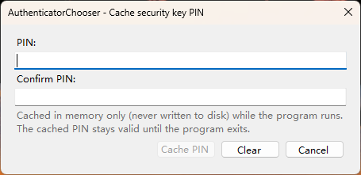
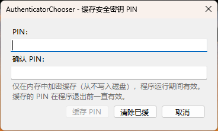
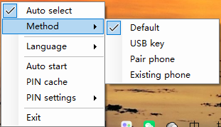
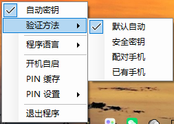
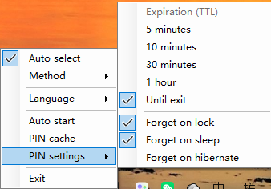
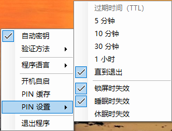

 PasskeyPick
===

[](https://github.com/f1owkang/PasskeyPick/releases) [](https://github.com/f1owkang/PasskeyPick/actions/workflows/dotnet.yml)

*带系统托盘图标的后台程序，自动跳过「配对手机」选项，并在 Windows FIDO/WebAuthn 弹窗中自动选择「USB 安全密钥」。*
*Background program with a system tray icon that skips the phone pairing option and chooses the USB security key in Windows FIDO/WebAuthn prompts.*

<!-- MarkdownTOC autolink="true" bracket="round" autoanchor="false" levels="1,2" -->

- [问题 / Problem](#问题--problem)
- [解决方案 / Solution](#解决方案--solution)
- [系统要求 / Requirements](#系统要求--requirements)
- [安装 / Installation](#安装--installation)
- [安全 / Security](#安全--security)
- [演示 / Demo](#演示--demo)
- [构建 / Building](#构建--building)
- [相关 / Related](#相关--related)

<!-- /MarkdownTOC -->

## 问题 / Problem

**中文**：当浏览器等程序通过 WebAuthn 请求认证时，Windows 会显示安全凭据弹窗，可用 USB 安全密钥，或用保存在 TPM 中、由 Windows Hello PIN 或生物识别保护的通行密钥完成认证。

Windows 11 [22H2 Moment 4](https://www.bleepingcomputer.com/news/microsoft/windows-11-moment-4-update-released-here-are-the-many-new-features/)（2023 年 9 月）及更高版本（含 [23H2](https://www.bleepingcomputer.com/news/microsoft/windows-11-23h2-new-features-in-the-windows-11-2023-update/)）新增了「选择通行密钥」步骤：弹窗会先询问使用「iPhone、iPad 或 Android 设备」还是「安全密钥」，选 USB 安全密钥需额外一次点击或三次按键；即使关闭蓝牙、没有手机也无法跳过，且 Windows 不会记住你的选择。

<p align="center"></p>

<p align="center"></p>

**English**: When a program (such as a WebAuthn-capable browser) requests authentication, Windows can show a security credential prompt that lets you authenticate with a USB security key or a passkey stored in the computer's TPM and protected by Windows Hello PIN or biometrics.

Windows 11 [22H2 Moment 4](https://www.bleepingcomputer.com/news/microsoft/windows-11-moment-4-update-released-here-are-the-many-new-features/) (September 2023) and later (including [23H2](https://www.bleepingcomputer.com/news/microsoft/windows-11-23h2-new-features-in-the-windows-11-2023-update/)) added a "Choose a passkey" step: the prompt first asks whether to use an "iPhone, iPad, or Android device" or a "Security key", and picking the USB security key costs an extra click or three keystrokes. You cannot opt out of this step even without Bluetooth or any Android/iOS device, and Windows does not remember your choice.

## 解决方案 / Solution

**中文**：这是一个在 Windows 用户会话中后台运行、**驻留系统托盘**的程序（右键托盘图标可启用/禁用自动选择、切换首选验证方法、切换语言、缓存安全密钥 PIN、管理 GPG 转发等，详见下文各节）。它等待 Windows FIDO 凭据提供程序弹窗出现，然后自动为你选择「安全密钥」选项——从用户角度看，蓝牙界面几乎刚出现就被替换为「插入你的 USB 安全密钥」的提示。程序内部使用 [Microsoft UI Automation](https://learn.microsoft.com/en-us/windows/win32/winauto/uiauto-uiautomationoverview) 读取并操作这些对话框。

<p align="center"></p>

**English**: This is a background program that runs in your Windows user session with a **system tray GUI** — a tray icon with a right-click menu for enabling/disabling automatic selection, choosing the preferred authenticator, switching the language, caching the security key PIN, and managing GPG forwarding (see the sections below). It waits for Windows FIDO credential provider prompts to appear, then chooses the Security Key option for you automatically — from the user's perspective, the Bluetooth screen barely appears before it is replaced with the prompt to plug in your USB security key. Internally, it uses [Microsoft UI Automation](https://learn.microsoft.com/en-us/windows/win32/winauto/uiauto-uiautomationoverview) to read and interact with the dialog boxes.

### 覆盖自动行为 / Overriding the automatic next behavior

**中文**：默认情况下，本程序不会干预本地 TPM 通配密钥弹窗（如 Windows Hello PIN 或生物识别），也不会自动提交包含「USB 安全密钥」和「配对新手机」以外选项的弹窗（如已配对手机、PIN 或第三方 passkey 提供商）——它无法判断你是否更想用那些选项。大多数情况下想优先 USB 安全密钥，可在托盘菜单「首选验证方法」中选中「USB 安全密钥」；只有想在**所有**情况下都强制选 USB 安全密钥时，才用 `--skip-all-non-security-key-options`。

- 若想移除已配对的手机选项，可编辑注册表取消配对（换机或旧手机[变砖](https://en.wikipedia.org/wiki/Pixel_5a#Known_issues)时很有用）。
- 若偶尔想用一次手机蓝牙通配密钥，可在弹窗出现时按住 <kbd>Shift</kbd>，临时禁止本程序自动提交一次。
- 即使本程序不点「下一步」（有额外选项或按住 <kbd>Shift</kbd>），它仍会高亮「安全密钥」并聚焦「下一步」，你按 <kbd>Enter</kbd> 或 <kbd>Space</kbd> 即可。

**English**: By default, the program does not interfere with local TPM passkey prompts (like Windows Hello PIN or biometrics) and does not auto-submit FIDO prompts that contain options beyond a USB security key and pairing a new phone (such as an already-paired phone, a PIN, or a third-party passkey provider) — it cannot know whether you prefer those. To prefer the USB security key in most cases, choose it under **Preferred authenticator** in the tray menu; only use `--skip-all-non-security-key-options` to force it in **_all_** cases.

- To remove an already-paired phone option, edit the registry to unpair it (useful after a phone [bricked itself](https://en.wikipedia.org/wiki/Pixel_5a#Known_issues) or an upgrade).
- To use a smartphone Bluetooth passkey once, hold <kbd>Shift</kbd> when the dialogs appear to suppress auto-submission for that one prompt.
- Even when it doesn't click Next (an extra choice was present, or Shift is held), it still highlights the Security Key option and focuses Next, so <kbd>Enter</kbd> or <kbd>Space</kbd> is all you need.

### 自动填 PIN / Auto-filling the security key PIN

**中文**：自 2025 年 9 月起，Windows 11 要求 FIDO2 安全密钥每次认证都输入 PIN。想自动填入并提交，**右键托盘图标 →「PIN 缓存」**（勾选表示已缓存）打开对话框：

<p align="center"> </p>

PIN 只通过对话框输入（不会出现在命令行），**加密后仅缓存在内存**（Windows `CryptProtectMemory`，进程级密钥，从不写盘），默认 600 秒过期——时长与失效时机可在托盘「PIN 设置」中调整。该功能只适用于**单把安全密钥**（插多把时拒绝缓存，避免把 PIN 输进错误的密钥导致锁死）。清除缓存：再次打开对话框选「清除已缓存 PIN」，或开启托盘「PIN 设置」中的「锁屏 / 睡眠 / 休眠时失效」。注意：即使内存加密，能操作这台电脑的人仍可能在认证期间借它完成认证，详见[免责声明](#安全--security)。

高级（命令行）：`--autosubmit-pin-length=$num` 可让你输满 $num 个字符（最少 4）后自动提交 PIN 弹窗。注意——连续输错足够多次（YubiKey 为 8 次）会永久锁定密钥；注册新凭据、修改 PIN 或输入 Windows Hello PIN 时不会自动提交。

**English**: Since September 2025, Windows 11 requires a FIDO2 security key to be unlocked with its PIN on every assertion. To have the program fill in and submit it, **right-click the tray icon → "PIN cache"** (checked when a PIN is cached) to open the dialog above.

The PIN is only ever entered in the dialog (never on a command line), cached **encrypted in memory** (Windows `CryptProtectMemory`, a per-process key, never written to disk), and expires after 600 seconds by default — both the expiry and the forget timing are adjustable under "PIN settings" in the tray menu. It only works with a **single security key** (with several attached, caching is refused rather than risk locking out the wrong key). To clear it, open the dialog again and choose "Clear cached PIN", or enable "Forget on lock / sleep / hibernate" in "PIN settings". Note that even encrypted in memory, anyone who can operate this computer could use your key while you are authenticated — see the [disclaimer](#安全--security).

Advanced (command line): `--autosubmit-pin-length=$num` submits the PIN prompt once you have typed $num characters (minimum 4). Type with care — enough consecutive wrong submissions (8 on YubiKeys) permanently block the key; it never auto-submits when registering a new credential, changing your PIN, or entering a Windows Hello PIN.

### 第三方 passkey 提供商（优先级文件）/ Choosing among third-party passkey providers (priority file)

**中文**：Windows 25H2 允许 1Password、Bitwarden、KeePass 等注册为 passkey 提供商。默认发现这类非「USB 安全密钥 / 配对手机」的选项时本程序会停止自动提交。**最简单的方式**是直接在托盘「首选验证方法」中点选已注册的提供商。需要更细规则时，可在可执行文件旁创建 `priority.txt`（或用 `--priority-file=PATH`），每行 `对话框中显示的选项名称 = 优先级数字`，数字越大越优先：

| 键 | 含义 |
|-----|---------|
| `USB` | USB 安全密钥选项 |
| `Pair new phone` | 配对新的蓝牙手机 |
| `Use existing phone` | 已配对的蓝牙手机 |

其他键与弹窗选项文本做大小写不敏感匹配。例如可用时优先 1Password，否则回退 USB：

```
1Password = 200
USB = 100
```

不配置规则时默认行为（优先 USB 安全密钥）不变。

**English**: Windows 25H2 lets password managers like 1Password, Bitwarden, KeePass, and others register as passkey providers. By default the program stops (does not auto-submit) when it sees an option that is neither the USB security key nor pairing a new phone. **The simplest way** is to pick a registered provider from the tray menu's "Preferred authenticator". For finer rules, create a `priority.txt` next to the executable (or point elsewhere with `--priority-file=PATH`); each line is `Display name as it appears in the dialog = priority number` (higher is more preferred):

| Key | Meaning |
|-----|---------|
| `USB` | The USB security key option |
| `Pair new phone` | Pairing a new Bluetooth phone |
| `Use existing phone` | An already-paired Bluetooth phone |

Every other key matches the dialog option text case-insensitively. For example, prefer 1Password when available and fall back to USB otherwise:

```
1Password = 200
USB = 100
```

With no rules configured, the default behavior (prefer the USB security key) is unchanged.

### 系统托盘图标 / System tray icon

**中文**：程序运行期间在系统托盘显示图标，右键可：

<p align="center"> </p>

- **启用 / 禁用自动选择安全密钥** —— 禁用后程序完全不触碰 FIDO 弹窗，便于手动选择其他认证器。
- **首选验证方法（Preferred authenticator）** —— 列出当前系统可用的验证方法（自动获取），包括「默认」「USB 安全密钥」「配对手机」「使用已有手机」及已注册的第三方 passkey 提供商。与 `--priority-file` 配合时可覆盖其优先级。
- **语言（Language）** —— 切换界面语言（跟随系统 / English / 简体中文 / 繁體中文），立即生效无需重启。
- **开机自启（Start automatically at logon）** —— 以最高权限创建计划任务，登录时自动启动。
- **检查更新（Check for updates）** —— 手动检查 GitHub 上是否有新版本。
- **PIN 缓存（PIN cache）** —— 勾选表示已缓存 PIN，点击打开对话框缓存或清除（仅存内存、不落盘，见「自动填 PIN」）。
- **PIN 设置（PIN settings）** —— 子菜单：**过期时间（TTL）**（5 分钟 / 10 分钟默认 / 30 分钟 / 1 小时 / 直到退出）；**锁屏时 / 睡眠时 / 休眠时失效**三个开关。
- **GPG 设置（GPG Settings）** —— 打开 GPG 转发配置中心（唯一的图形配置入口，见下一节）。
- **GPG 诊断（GPG Diagnostics）** —— 一键生成可复制的诊断报告（见下一节）。
- **退出（Exit）** —— 退出程序。

以下偏好持久化到 `%APPDATA%\PasskeyPick\settings.json` 并在重启后恢复：界面语言、「自动密钥」开关、首选验证方法、PIN 缓存 TTL 与锁屏/睡眠/休眠失效开关，以及 GPG 转发设置（桥、守护、端口）。PIN 本身从不写入磁盘。

**English**: A system tray icon appears while the program is running. Right-click it to:

- **Enable / disable automatic security key selection** — when disabled, the program leaves all FIDO dialogs untouched.
- **Preferred authenticator** — lists the authentication methods currently available (auto-enumerated): "Default (automatic)", "USB security key", "Pair a new phone", "Use an existing phone", plus any registered third-party passkey providers. Combined with `--priority-file`, it can override its priorities.
- **Language** — switches the UI language at runtime with immediate effect: "Follow system language", English, 简体中文, 繁體中文.
- **Start automatically at logon** — registers (or removes) a scheduled task that starts the program at logon with highest privileges.
- **Check for updates** — manually checks GitHub for a newer release.
- **PIN cache** — checked when a security key PIN is cached; clicking it opens the dialog that caches or clears the PIN (memory only, never on disk; see "Auto-filling the security key PIN").
- **PIN settings** — a grouped submenu: **Expiration (TTL)** (5 min / 10 min default / 30 min / 1 hour / until exit) and **Forget on lock / sleep / hibernate** toggles.
- **GPG Settings** — opens the only GUI configuration entry for GPG forwarding (see the next section).
- **GPG Diagnostics** — generates a one-click copyable diagnostics report (see the next section).
- **Exit** — quits the program.

The following preferences are persisted to `%APPDATA%\PasskeyPick\settings.json` and restored after a restart: the UI language, the automatic-selection toggle, the preferred authenticator, the PIN cache TTL and lock/sleep/hibernate toggles, and the GPG forwarding settings (bridge, daemon, port). The PIN itself is never written to disk.

<p align="center"> </p>

### GPG 桥与 gpg-agent 管理 / GPG bridge & gpg-agent management

**中文**：托盘新增两个一级菜单项 **GPG 设置** 与 **GPG 诊断**：

- **GPG 设置** —— GPG 转发配置中心（唯一的配置入口），分三个区：
  - **功能配置**：**GPG-agent 转发**（开启本地转发桥）与 **GPG-agent 守护**（登录时拉起 gpg-agent 并保活）两个开关，默认**关闭**。
  - **转发参数**：**GPG 转发端口**（默认 `4321`）+ SSH `RemoteForward` 配置示例。
  - **运行状态**：实时显示 Gpg4win 路径、桥是否在监听、gpg-agent 是否在运行。
- **GPG 诊断** —— 一键生成可复制的诊断报告（gpg 版本与路径、gpg-agent 进程路径、gpgconf 各 socket 路径、`SSH_AUTH_SOCK`、`ssh-add -L`、`gpg --card-status`、OpenSSH Authentication Agent 服务状态）。

**通过 SSH 在远程机器上使用你的 YubiKey**：在远程主机的 `~/.ssh/config` 加入一行（`<远程 socket>` 为远程运行 `gpgconf --list-dir agent-extra-socket` 得到的值，`<端口>` 与设置中的转发端口一致）：

```
RemoteForward <远程 socket> 127.0.0.1:<端口>
```

配置后，远程主机的提交就会用本地 YubiKey 托管的 gpg-agent 签名，并在 GitHub 显示 **Verified** 徽标。**GPG-agent 守护** 会在登录时启动 Gpg4win 的 gpg-agent，并每 30 秒检查一次，socket 不可达时自动重启。

> **安全说明（重要）**：桥只监听回环地址（loopback）且默认关闭。但一旦启用，本机**任何进程**（包括其他 Windows 用户账户下运行的程序）都能通过它访问你的 gpg-agent 并代你签名/解密——**签名并不总是要求 PIN 确认**（gpg-agent 会缓存口令、智能卡可能只要求 touch、SSH 签名通常不弹 PIN）。这与 SSH agent 转发（`ssh -A`）的风险同类且暴露面更大。仅在可信的、单用户的机器上启用。

高级（命令行）：`--gpg-bridge-port=$port` 可覆盖转发端口，推荐在 GUI 设置中配置。

**English**: The tray menu gains two **top-level** items, **GPG Settings** and **GPG Diagnostics**:

- **GPG Settings** — the single GPG forwarding configuration hub, in three sections:
  - **Features**: two toggles, both **off by default** — **GPG-agent forwarding** (the local forwarding bridge) and **GPG-agent daemon** (start the gpg-agent at logon and keep it alive).
  - **Forwarding parameters**: the **GPG forwarding port** (default `4321`) plus an SSH `RemoteForward` config example.
  - **Running status**: live state of the Gpg4win path, the bridge listener, and the gpg-agent.
- **GPG Diagnostics** — generates a one-click copyable report (gpg version and path, gpg-agent process path, gpgconf socket paths, `SSH_AUTH_SOCK`, `ssh-add -L`, `gpg --card-status`, and the OpenSSH Authentication Agent service state).

**Using your YubiKey over SSH**: add a line to `~/.ssh/config` on the remote machine (`<remote socket>` is the value of `gpgconf --list-dir agent-extra-socket` there; `<port>` must match the forwarding port in the dialog):

```
RemoteForward <remote socket> 127.0.0.1:<port>
```

Once configured, commits on the remote machine are signed by your local YubiKey-backed gpg-agent and show a **Verified** badge on GitHub. **GPG-agent daemon** starts the Gpg4win agent at logon and checks it every 30 seconds, restarting it if its socket becomes unreachable.

> **Security note (important)**: the bridge listens on loopback only and is off by default. But once enabled, **any local process** (including programs running under other Windows user accounts) can reach your gpg-agent through it and sign or decrypt on your behalf — and **signing does not always require a PIN prompt** (gpg-agent caches passphrases, smartcards may be touch-only, and SSH-agent signing usually does not prompt). This is the same class of risk as SSH agent forwarding (`ssh -A`) but with a wider exposure. Only enable it on a trusted, single-user machine.

Advanced (command line): `--gpg-bridge-port=$port` overrides the forwarding port, though configuring it in the settings dialog is the recommended path.

## 系统要求 / Requirements

**中文**：

- Windows 11 25H2、24H2、23H2，或 [22H2 Moment 4](https://support.microsoft.com/en-us/topic/september-26-2023-kb5030310-os-build-22621-2361-preview-363ac1ae-6ea8-41b3-b3cc-22a2a5682faf)
- [.NET Desktop Runtime 10](https://dotnet.microsoft.com/en-us/download/dotnet/10.0/runtime) 或更高，x64 或 arm64（原生 WinForms 托盘界面）
- 通过远程桌面（RDP）使用 Windows 时，本程序必须运行在客户端而非服务器上，因为 FIDO 弹窗会在客户端显示

**English**:

- Windows 11 25H2, 24H2, 23H2, or [22H2 Moment 4](https://support.microsoft.com/en-us/topic/september-26-2023-kb5030310-os-build-22621-2361-preview-363ac1ae-6ea8-41b3-b3cc-22a2a5682faf)
- [.NET Desktop Runtime 10](https://dotnet.microsoft.com/en-us/download/dotnet/10.0/runtime) or later, either x64 or arm64 (native WinForms tray UI)
- When using Windows over Remote Desktop Connection, this program must run on the client, not the server, because FIDO prompts are forwarded and displayed by the client

## 安装 / Installation

**中文**：

1. [下载与 CPU 架构对应的发布版 `PasskeyPick-win-x64.exe` 或 `PasskeyPick-win-arm64.exe`。](https://github.com/f1owkang/PasskeyPick/releases/latest)
1. 重命名为 `PasskeyPick.exe` 并放到你选择的目录，如 `C:\Program Files\PasskeyPick\`。
    - 发布版为框架依赖的单文件（约 2 MB），首次运行前需安装 [.NET Desktop Runtime 10](https://dotnet.microsoft.com/en-us/download/dotnet/10.0/runtime)。
1. 双击 `PasskeyPick.exe` 运行。没有主窗口，程序驻留系统托盘（右键图标打开设置菜单），可在任务管理器中搜索 `PasskeyPick` 确认运行。
1. 如需开机自启，**右键托盘图标 → 勾选「开机自启」**（详见[系统托盘图标](#系统托盘图标--system-tray-icon)）。等效地，可运行一次 `.\PasskeyPick --autostart-on-logon`，或自行在任务计划程序中以你的用户身份、最高权限创建登录任务。

**English**:

1. [Download `PasskeyPick-win-x64.exe` or `PasskeyPick-win-arm64.exe` for your CPU architecture.](https://github.com/f1owkang/PasskeyPick/releases/latest)
1. Rename it to `PasskeyPick.exe` and save it to a directory of your choice, like `C:\Program Files\PasskeyPick\`.
    - The release is a framework-dependent single file (~2 MB); install the [.NET Desktop Runtime 10](https://dotnet.microsoft.com/en-us/download/dotnet/10.0/runtime) before the first run.
1. Run it by double-clicking. No main window appears — it lives in the system tray (right-click the icon for the settings menu); search for `PasskeyPick` in Task Manager to confirm it's running.
1. To start at logon, **right-click the tray icon and check "Start automatically at logon"** (see [System tray icon](#系统托盘图标--system-tray-icon)). Alternatively, run `.\PasskeyPick --autostart-on-logon` once, or create a Task Scheduler task that starts `PasskeyPick.exe` as your user with highest privileges.

## 安全 / Security

**中文**：本程序必须**始终以管理员权限运行**，才能与 Windows 安全中心（`CredentialUIBroker.exe`，更高的完整性级别）的 FIDO 弹窗交互——这是 Windows 用户界面特权隔离（UIPI）的要求，普通权限下无法工作。

由于程序以最高权限常驻后台，请把它部署到**受保护目录**（如 `C:\Program Files\PasskeyPick\`），不要放在低权限用户可写的目录，否则低权限用户可能利用 DLL 搜索顺序劫持加载恶意 DLL，或篡改 `priority.txt` 重定向认证。程序启动时会检查部署目录是否可被低权限用户写入并记入日志；属主不是本人或本地管理员的 `priority.txt` 会被忽略。

程序只与**微软签名、位于 System32 的系统进程**（`CredentialUIBroker.exe`、`Consent.exe` 等）持有的 FIDO 弹窗交互，其他进程无法伪造弹窗窃取缓存的安全密钥 PIN。

**English**: This program must **always run as administrator** to interact with the Windows Security FIDO dialogs, hosted by `CredentialUIBroker.exe` at a higher integrity level — Windows User Interface Privilege Isolation (UIPI) requires this, and it cannot work unelevated.

Because it runs elevated in the background, install it in a **protected directory** (for example `C:\Program Files\PasskeyPick\`), not one writable by lower-privileged users, or they could hijack DLL search order to load a malicious DLL, or tamper with `priority.txt` to redirect authentication. On startup the program checks whether its directory is writable by unprivileged users and warns in the log; a `priority.txt` owned by anyone other than you or a local administrator is ignored.

The program only interacts with FIDO dialogs owned by **Microsoft-signed system processes in System32** (`CredentialUIBroker.exe`, `Consent.exe`, etc.), so other processes cannot spoof a prompt to steal the cached security key PIN.

**免责声明 / Disclaimer**

**中文**：本程序（包括 PIN 缓存、自动填 PIN、自动提交 PIN）按「现状」提供，不附带任何明示或暗示的保证。**缓存 PIN 存在固有风险**：即使 PIN 仅加密保存在内存、从不写盘，任何能操作这台电脑的人或进程，都可能在你保持认证状态期间用该缓存 PIN 完成未授权认证；自动填/自动提交也可能因输错导致安全密钥被连续锁定。使用本程序即表示你理解并**自行承担全部风险**，包括但不限于未授权认证、认证失败、安全密钥被锁死、数据丢失或财产损失。**仓库作者对因使用本程序而产生的任何后果不承担责任。**

**English**: This program (including PIN caching, PIN auto-fill, and PIN auto-submit) is provided "as is", without warranty of any kind, express or implied. **Caching a PIN carries inherent risk**: even though the PIN is only ever stored encrypted in memory and never written to disk, any person or process that can operate this computer could use the cached PIN to authenticate without your authorization while you remain authenticated; auto-filling or auto-submitting a PIN could also lock out the security key after too many wrong entries. By using this program you acknowledge and **assume all risk**, including but not limited to unauthorized authentication, authentication failures, a locked-out security key, data loss, or financial damage. **The repository author accepts no responsibility for any consequence of using this program.**

## 演示 / Demo

**中文**：想用示例 FIDO 认证弹窗测试，请访问 [WebAuthn.io](https://webauthn.io) 并点击 **Authenticate** 按钮。

**English**: To test with a sample FIDO authentication prompt, visit [WebAuthn.io](https://webauthn.io) and click the **Authenticate** button.

## 构建 / Building

**中文**：想自己构建而不是从[发布页](https://github.com/f1owkang/PasskeyPick/releases)下载，可按以下步骤。

1. 安装[最新稳定版 .NET SDK](https://dotnet.microsoft.com/en-us/download)（10 或更高）。
1. 克隆仓库并进入项目目录。
    ```ps1
    git clone "https://github.com/f1owkang/PasskeyPick.git"
    cd .\PasskeyPick\PasskeyPick\
    ```
1. 选择要构建的[版本标签](https://github.com/f1owkang/PasskeyPick/tags)，或跳过以使用 `master` 最新提交。
    ```sh
    git checkout 0.7.0
    ```
1. 构建并发布（`PublishSingleFile=true` 生成单文件、`SelfContained=false` 框架依赖，约 2 MB，目标机需 [.NET Desktop Runtime 10](https://dotnet.microsoft.com/en-us/download/dotnet/10.0/runtime)）。
    ```ps1
    dotnet publish -c Release -r win-x64 -p:PublishSingleFile=true
    ```

假设 CPU 为 x64，发布路径为：

```text
.\bin\Release\net10.0-windows10.0.19041.0\win-x64\publish\PasskeyPick.exe
```

也可用 [Visual Studio](https://visualstudio.microsoft.com/vs/) Community 2022 或 2026 等 IDE。

**English**: If you want to build this application yourself instead of downloading precompiled binaries from the [releases](https://github.com/f1owkang/PasskeyPick/releases) page, follow these steps.

1. Install the [latest stable .NET SDK](https://dotnet.microsoft.com/en-us/download) (10 or later).
1. Clone the repository and enter the project directory.
    ```ps1
    git clone "https://github.com/f1owkang/PasskeyPick.git"
    cd .\PasskeyPick\PasskeyPick\
    ```
1. Choose one of the [version tags](https://github.com/f1owkang/PasskeyPick/tags), or skip this step to use the head commit on `master`.
    ```sh
    git checkout 0.7.0
    ```
1. Build and publish (`PublishSingleFile=true` produces a single-file executable; `SelfContained=false` makes it framework-dependent at ~2 MB, but the target machine needs the [.NET Desktop Runtime 10](https://dotnet.microsoft.com/en-us/download/dotnet/10.0/runtime)).
    ```ps1
    dotnet publish -c Release -r win-x64 -p:PublishSingleFile=true
    ```

Assuming an x64 CPU, the program is published to:

```text
.\bin\Release\net10.0-windows10.0.19041.0\win-x64\publish\PasskeyPick.exe
```

You can also use an IDE like [Visual Studio](https://visualstudio.microsoft.com/vs/) Community 2022 or 2026.

## 相关 / Related

### 创建新 passkey / Creating new passkeys

**中文**：当网站强制新 passkey 只能存在 TPM 或安全密钥上时，可安装 [**Create Passkeys Anywhere** 用户脚本](https://github.com/Aldaviva/userscripts/raw/master/create-passkeys-anywhere.user.js)（需 [Tampermonkey](https://tampermonkey.net/) 等扩展，Windows 与 Android 浏览器均可用）。安装后每次创建 passkey 都会询问存储位置；也可编辑脚本源码中的 `options.allowedPasskeyCreationStorage`（`anywhere` / `securityKey` / `tpm`）限定保存位置。

**English**: When a website forces a new passkey to be stored only in the TPM or only on a security key, install my [**Create Passkeys Anywhere** user script](https://github.com/Aldaviva/userscripts/raw/master/create-passkeys-anywhere.user.js) (requires [Tampermonkey](https://tampermonkey.net/) or similar; works on Windows and Android browsers). It then asks where to save each new passkey; you can also set `options.allowedPasskeyCreationStorage` in the script source (`anywhere` / `securityKey` / `tpm`) to restrict the destination.
